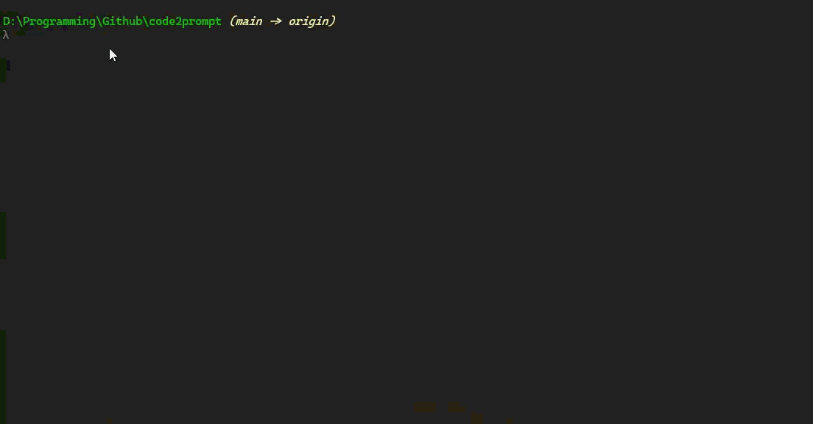

# Code2Prompt-tui

> **Note:** This project is a fork of the original [**code2prompt**](https://github.com/mufeedvh/code2prompt) by [Mufeed VH](https://github.com/mufeedvh) and other contributors. It builds upon its excellent foundation by adding a sophisticated, full-featured interactive Terminal User Interface (TUI) for file selection.

**Code2Prompt** is a blazingly fast command-line tool designed to generate comprehensive, context-aware prompts for Large Language Models (LLMs) from any codebase. It intelligently traverses your project, filters files, and uses a powerful templating engine to construct the perfect prompt for your needs.

Its standout feature is a sophisticated interactive TUI that allows you to visually select files and directories, giving you fine-grained control over your prompt's content in real-time.



## Key Features

- **🚀 Blazing Fast:** Leverages parallel file processing using `ignore` and `rayon` to scan even massive repositories in seconds.
- **💻 Interactive TUI Selector:** A `ratatui`-based interface to visually navigate your project tree, see token counts, and interactively select the files and directories to include.
- **🧠 Intelligent Filtering:** Filter files by glob patterns, file extensions, and `.gitignore` rules. Handle conflicts with an include-priority system.
- **🔧 Powerful Templating:** Uses a `Handlebars` templating engine to give you full control over the final prompt structure. Inject file contents, a directory tree, git diffs, and more.
- **📊 Token Awareness:** Counts tokens using official `tiktoken` tokenizers (`cl100k`, `o200k_base`, etc.) and can display a visual token map to identify the most "expensive" files.
- **⚡ Efficient Caching:** Caches file scan results and TUI selections to make subsequent runs instantaneous.
- **-️ Git Integration:** Directly include `git diff` or `git log` output for specific branches in your prompt.
- **📦 Cross-Platform:** A single, self-contained binary that works on Linux, macOS, and Windows.

## Installation

Download the latest pre-compiled binary for your operating system from the [GitHub Releases](https://github.com/t5k6/code2prompt-tui/releases) page.

### From Source

Ensure you have the Rust toolchain installed.

```bash
git clone https://github.com/t5k6/code2prompt-tui.git
cd code2prompt-tui
cargo build --release --features full

# The binary will be at target/release/code2prompt-tui
./target/release/code2prompt-tui --version
```

## Usage

### Basic Usage (Interactive Mode)

The easiest way to use the tool is to point it at a directory. This will launch the interactive TUI selector.

```bash
code2prompt-tui .
```

The TUI provides a powerful way to visualize your codebase and select files.

| Key(s)               | Action                                          | Pane             |
| -------------------- | ----------------------------------------------- | ---------------- |
| `Tab`                | Switch between panes                            | Both             |
| `↑` / `k`            | Move cursor up                                  | Both             |
| `↓` / `j`            | Move cursor down                                | Both             |
| `Space`              | Toggle selection for the highlighted item       | Both             |
| `→` / `l`            | Expand directory / Move to directory pane       | Directories / Ext |
| `←` / `h`            | Collapse directory or move to parent/other pane | Directories      |
| `a`                  | Select All visible file types                   | File Types       |
| `n`                  | Deselect All visible file types                 | File Types       |
| `i`                  | Invert selection for visible file types         | File Types       |
| `/`                  | Enter filtering mode for file types             | File Types       |
| `s`                  | Open Settings popup                             | Both             |
| `Enter`              | Confirm selections and generate prompt          | Both             |
| `q` / `Esc`          | Quit the application                            | Both             |

### Non-Interactive Examples

```bash
# Include only Rust and TOML files, non-interactively
code2prompt-tui . --extensions rs,toml --no-interactive

# Exclude the 'tests' directory and generate a JSON output
code2prompt-tui . -e "tests/**" -F json

# Get a diff of the current branch against `main` and send it to an output file
code2prompt-tui . --diff --git-diff-branch main,HEAD -O prompt.txt

# Use a custom template
code2prompt-tui . --template ./my-custom-template.hbs
```

### Full CLI Options

<details>
<summary>Click to expand full CLI help</summary>

```text
A command-line (CLI) tool to generate an LLM prompt from codebases of any size, fast.

Usage: code2prompt-tui [OPTIONS] <PATH>

Arguments:
  <PATH>

Options:
  -i, --include <INCLUDE>
          Patterns to include, comma-separated

  -e, --exclude <EXCLUDE>
          Patterns to exclude, comma-separated

      --extensions <EXTENSIONS>
          File extensions to include, comma-separated (e.g. "rs,toml")

      --include-priority
          Include files in case of conflict between include and exclude patterns

  -O, --output-file <OUTPUT_FILE>
          Optional output file path

  -F, --output-format <OUTPUT_FORMAT>
          Output format: markdown, json, or xml
          [default: markdown]
          [possible values: markdown, json, xml]

  -T, --template <TEMPLATE>
          Optional Path to a custom Handlebars template

  -V, --var <VARS>
          Inline template variable, e.g., -V issue=123 -V author="Ada L." (repeatable)

      --vars-file <VARS_FILE>
          Path to a TOML/JSON/YAML file containing template variables

      --list-templates
          List discovered templates and exit

      --no-var-cache
          Skip reading or writing cached variable answers

      --full-directory-tree
          List the full directory tree (opposite of current exclude_from_tree)

  -t, --tokenizer <TOKENIZER>
          Tokenizer to use for token counting.

          Supported: o200k_base, cl100k
          [possible values: o200k-base, cl100k, p50k-base, p50k-edit, r50k_base]

      --tokens <FORMAT>
          Display the token count of the generated prompt.
          Accepts a format: "raw" (machine parsable) or "format" (human readable)
          [default: format]
          [possible values: format, raw]

      --diff


      --git-diff-branch <BRANCHES>
          Generate git diff between two branches

      --git-log-branch <BRANCHES>
          Retrieve git log between two branches

  -l, --line-numbers
          Add line numbers to the source code

      --relative-paths
          Use relative paths instead of absolute paths

  -L, --follow-symlinks
          Follow symlinks

      --hidden
          Include hidden directories and files

      --no-codeblock
          Disable wrapping code inside markdown code blocks

      --no-clipboard
          Disable copying to clipboard

      --no-ignore
          Skip .gitignore rules

      --no-default-excludes
          Disable the default exclude patterns (.git, target/, etc.)

      --no-interactive
          Disable all interactive prompts (for use in scripts)

      --sort <SORT>
          Sort order for files
          [possible values: name-asc, name-desc, date-asc, date-desc]

      --token-map
          Display a visual token map of files

      --token-map-lines <NUMBER>
          Maximum number of lines to display in token map (default: 20)

      --experimental-tree
          [DEBUG] Print the experimental directory tree and exit

      --token-map-min-percent <PERCENT>
          Minimum percentage of tokens to display in token map (default: 0.1%)

      --cache


  -h, --help
          Print help (see more with '--help')

  -V, --version
          Print version

EXAMPLES:
    code2prompt-tui .
        Scans the current directory interactively.
    code2prompt-tui . --extensions rs,toml
        Includes only files with .rs and .toml extensions.
    code2prompt-tui /path/to/project -e '**/tests/*_snapshots/*'
        Scans a different path and excludes snapshot files from tests.
    code2prompt-tui . --extensions rs,toml --no-interactive
        Include only Rust and TOML files non-interactively
    code2prompt-tui . -e "tests/**" -F json
        Exclude the 'tests' directory and generate a JSON output
    code2prompt-tui . --diff -O prompt.txt
        Get a diff of the current branch and send it to an output file
```
</details>

---

## Templating

`code2prompt-tui` uses the [Handlebars](https://handlebarsjs.com/) templating language to construct the final prompt. You can provide your own template with `--template <path>`.

### Available Template Variables

| Variable             | Description                                                   |
| -------------------- | ------------------------------------------------------------- |
| `{{absolute_code_path}}` | The absolute path to the root of the scanned project.         |
| `{{source_tree}}`    | A `termtree`-style string representing the project structure.   |
| `{{#each files}}...{{/each}}` | Loop over each selected file.                                 |
| `{{this.path}}`      | The relative or absolute path to the file.                    |
| `{{this.code}}`      | The full content of the file, wrapped in a markdown block.    |
| `{{this.extension}}` | The file's extension (e.g., "rs", "py").                      |
| `{{git_diff}}`       | The output of `git diff` for staged and unstaged changes.     |
| `{{git_diff_branch}}` | The output of `git diff` between two specified branches.     |
| `{{git_log_branch}}`  | The output of `git log` between two specified branches.      |
| `{{your_custom_var}}` | Any variable passed via `-V` flag or a vars file.             |

### Default Template

This is the built-in template used if no other is provided:

```handlebars
The user wants to understand the following project.
Project path: {{absolute_code_path}}

This is the directory structure:
{{source_tree}}

These are the file contents:
{{#each files}}
File: {{this.path}}
Content:
{{this.code}}
{{/each}}
```

### Custom Variables

You can inject your own variables into the template. The resolution order is:

1.  **CLI arguments:** `-V key=value` (highest priority)
2.  **Environment variables:** `C2P_KEY=value`
3.  **Vars file:** `--vars-file path/to/vars.toml`
4.  **Config file:** `[template.defaults]` in `config.toml`
5.  **Cached variables:** From previous interactive sessions (lowest priority)

## Configuration

You can create a configuration file at `<CONFIG_DIR>/code2prompt-tui/config.toml` to set persistent options. Note that the configuration directory is named `code2prompt` for compatibility with the original project.

Example `config.toml`:

```toml
# Default tokenizer to use if not specified on the CLI
tokenizer = "O200kBase"

# Always add line numbers to code blocks
line_numbers = true

# Never wrap code in markdown ``` blocks
# no_codeblock = true

# Add custom global exclude patterns
exclude = [
    "**/__pycache__/*",
    "**/*.snap",
]

# Set default values for template variables
[template.defaults]
project_goal = "Analyze the codebase for refactoring opportunities."
author = "Your Name"

# Override default TUI settings
[gui.settings]
hidden = true
follow_symlinks = false
```

## Contributing

Contributions are welcome! Please feel free to open an issue or submit a pull request. Check out `CONTRIBUTING.md` for more details on how to get started.

## License

This project is licensed under the **MIT License**. See the [LICENSE](LICENSE) file for details.